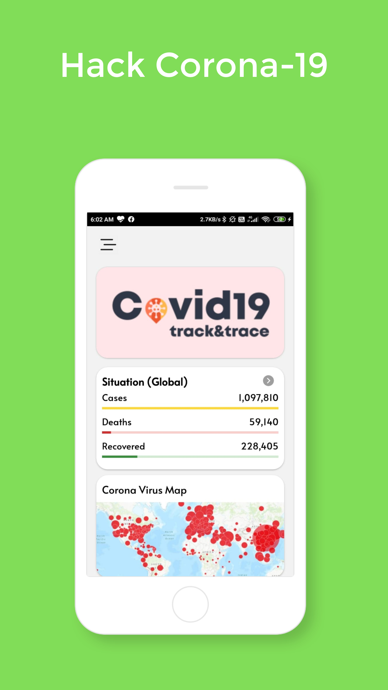
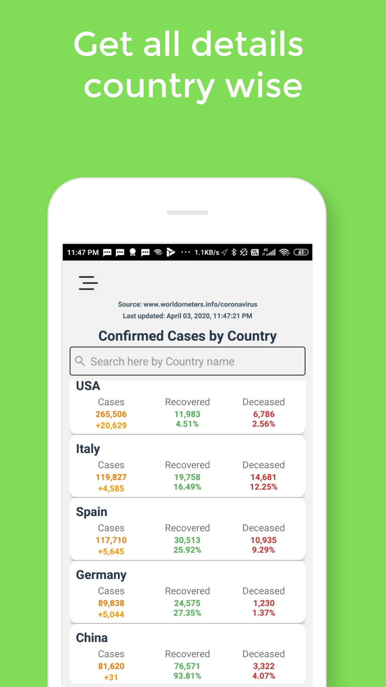
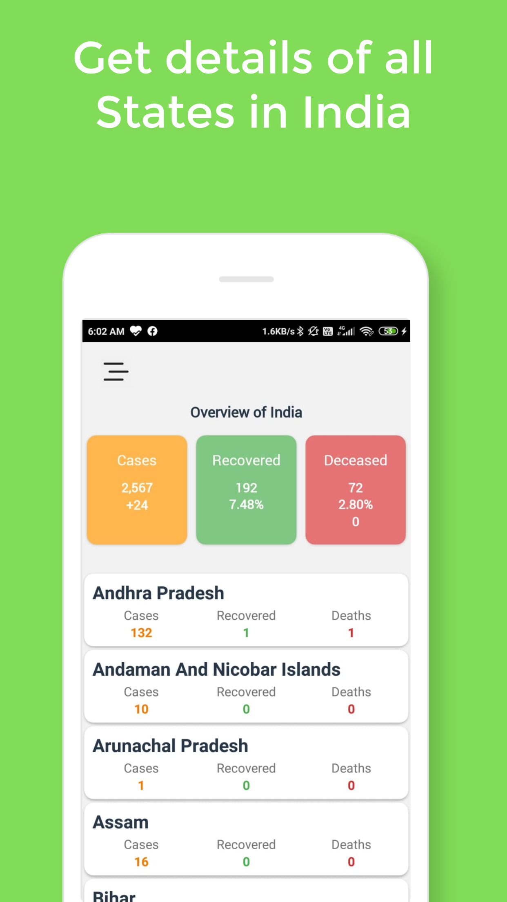
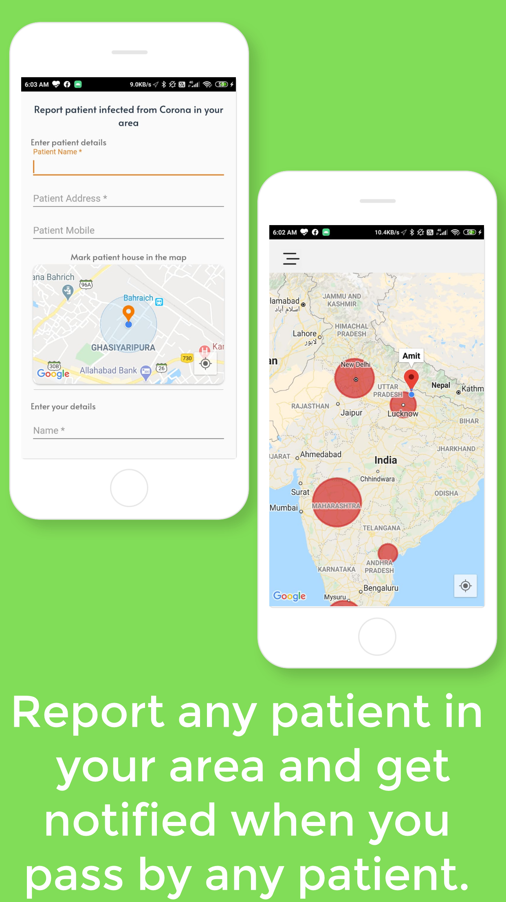
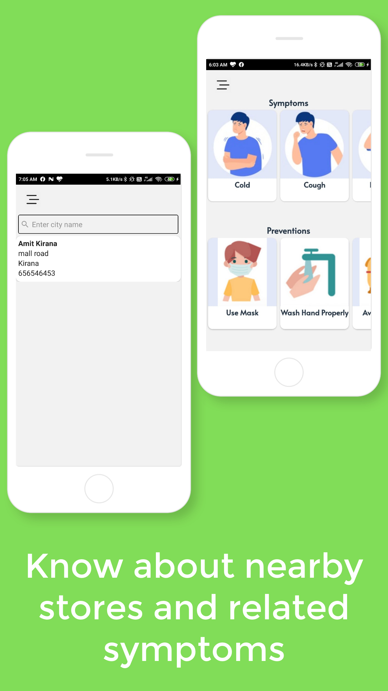
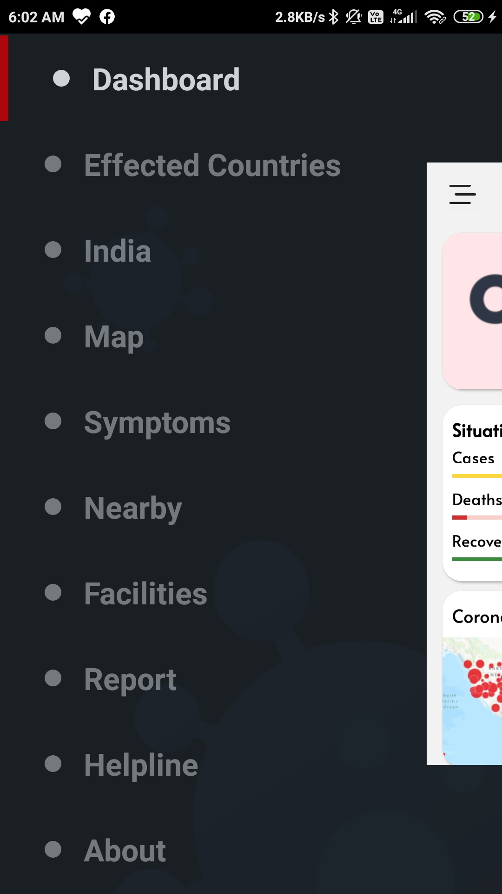
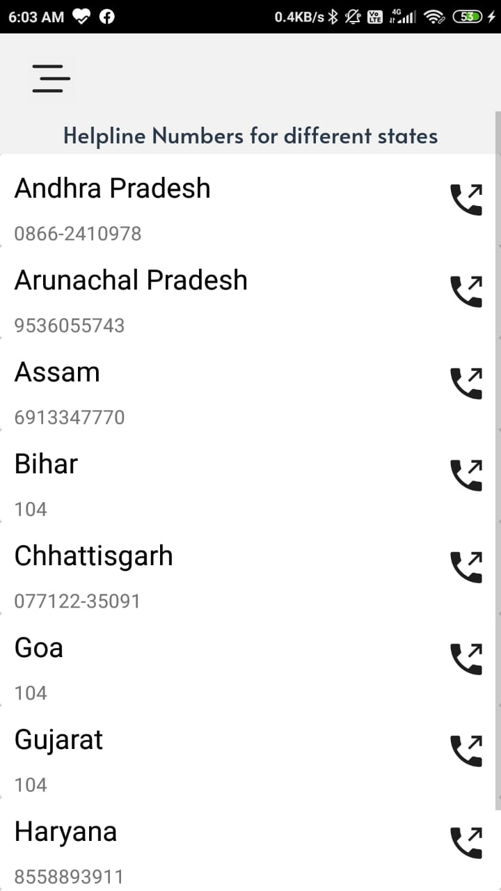

# Hack Covid-19

### Android app made for complete solution during Covid-19 and Quarantine.
- Get exact stats for corona spread in different countries and different states of India.
- Get the percentage of Risk in your state during app startup.
- Know who is infected in your area in a range of 5Km.
- Report for any person who is infected with corona in your locality.
- Locate the exact location of house of infected people in your locality.
- Get details of Medical Stores, Fruit and vegetables store or any other essential stores which open on particular day during quarantine.
- Generate your family pass for one person for going out during quarantine.
- Get Helpline numbers of different states.
- Know the symptoms of Corona and how you can prevent it.

Application is available here:

## Tech used
- Android 
- Java
- Firebase Firestore
- Model-View-Viewmodel Architecture
- Navigation component
- Retrofit 2
- GSON
- Glide
- ButterKnife
- Firebase Analytics

## Permissions

* Location/GPS

## Requirements
* Android version 5.0 and above

## Screenshots
<table>
  <tr>
    <td></td>
    <td></td>
    <td></td>
    <td></td>
  </tr>
  <tr>
    <td></td>
    <td></td>
    <td></td>
    <td></td>
  </tr>
</table>

## To Setup the project properly add the following to local.properties under Gradle Scripts
GOOGLE_MAP_KEY="Add your google map api key"

## License

This project is currently licensed under the MIT License A copy of [LICENSE](LICENSE.txt) should be present along with the source code.

